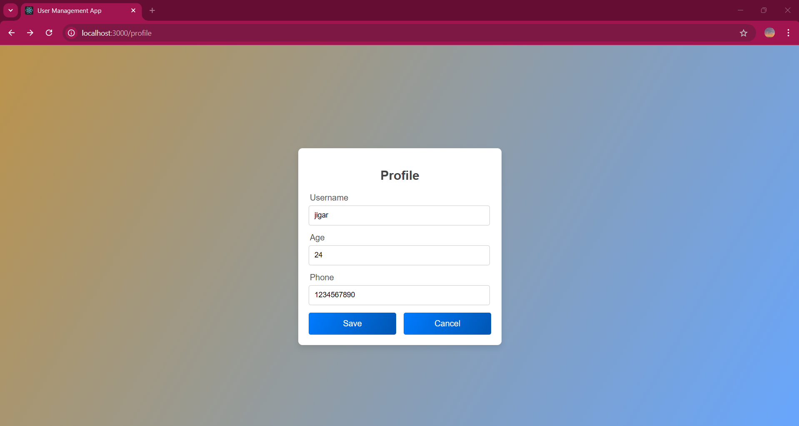

# User Management App

A simple React-based User Management App that allows users to register, log in, view, and update their profile. The app is built using React, React Router, and Axios, and includes password validation and notification handling with `react-toastify`.

## Features
- **User Registration:** Secure user registration with password validation.
- **User Login:** Login functionality with token-based authentication.
- **Profile Management:** Users can view and update their profile information.
- **Error Handling:** Displays error messages for failed requests or validation issues.
- **Responsive Design:** The app is designed to work across different devices.

---

## Installation

### Prerequisites
Ensure you have the following installed:
- **Node.js (v14.x or later)**
- **npm**

### Steps

1. **Clone the repository:**
```bash
git clone https://github.com/JigarHingu/user_management_app
cd frontend
```

2. **Install dependencies:**
```bash
npm install
```

3. Setup environment variables: Create a `.env` file in the root directory and add your API URL:
```bash
REACT_APP_API_URL=http://localhost:5000/api
```

4. Start the development server:
```bash
npm start
```

The app will be available at `http://localhost:3000`.

---

## Usage

### Register:

- Navigate to the registration page `(/register)`.
- Enter your username, email, and a secure password (at least 8 characters, including uppercase, lowercase, number, and a special character).
- Click "Create Account" to register.

### Login:

- Navigate to the login page `(/login)`.
- Enter your email and password.
- Click "Login" to access your profile.

### Profile:

- After logging in, view your profile information.
- Click "Edit Profile" to update your username, age, or phone number.

---

## Project Details

### Login Page:

- Location: `src/components/Login.js`
- Description: Allows users to log in with their email and password.
- Features:
   - Password visibility toggle.
   - Handles authentication using tokens stored in `localStorage`.

### Register Page:

- Location: `src/components/Register.js`
- Description: Allows users to register a new account.
- Features:
   - Password validation with real-time error messages.
   - Redirects to the login page after successful registration.

### Profile Page:

- Location: `src/components/Profile.js`
- Description: Allows users to view and update their profile details.
- Features:
   - Displays current profile information.
   - Edit mode for updating username, age, or phone number.
   - Token-based API calls for secure updates.

### Success Page:

- Location: `src/pages/SuccessPage.js`
- Description: Displays a success message after a successful action.

---

## API Endpoints

The app interacts with the following endpoints:

- `POST /users/register` - User registration.
- `POST /users/login` - User login.
- `GET /profile/me` - Fetch user profile.
- `PUT /profile/me` - Update user profile.

---

## Technologies Used

- React: Frontend library for building the UI.
- Axios: HTTP client for API requests.
- React Router: For routing between pages.
- react-toastify: For notifications and error handling.
- Font Awesome: For icons.

---

## Styling

- Global styles are defined in `styles.css`.
- Uses CSS classes for responsive design and user-friendly forms.
- Linear gradients for backgrounds and buttons.

---

## Backend Overview

The backend API for this project is built using Node.js and Express, with MongoDB as the database. It handles authentication, data validation, and CRUD operations for user profiles.

- Live = https://user-management-backend-lemon.vercel.app/

### Key Features:
- Secure JWT-based authentication.
- Password hashing using bcrypt.
- Validation of input fields, including email format and password strength.
- Database: MongoDB for storing user data.

---

1. **Clone the repository:**
```bash
cd backend
```

2. **Install dependencies:**
```bash
npm install
```

3. Setup environment variables: Create a `.env` file in the root directory and add your API URL:
```bash
MONGO_URI=
JWT_SECRET=
PORT=5000

```

4. Start the development server:
```bash
npm run dev
```

The app will be available at `http://localhost:5000`.

---

## Database Schema

The MongoDB database includes a `User` collection with the following fields:

| Field         | Type       | Description                          |
|---------------|------------|--------------------------------------|
| `_id`         | ObjectId   | Unique identifier for the user.      |
| `username`    | String     | User's chosen username.              |
| `email`       | String     | User's email address.                |
| `password`    | String     | Hashed password.                     |
| `age`         | Number     | User's age (optional).               |
| `phoneNumber` | String     | User's phone number (optional).      |

---

## API Response Examples

### Register User (POST /users/register)
**Request Body:**
```json
{
    "username": "JohnDoe",
    "email": "johndoe@example.com",
    "password": "Password@123"
}
```

### Response:

```json
{
    "message": "User registered successfully",
    "userId": "64bfc8904c9e9d3f88b0d9e1"
}
```

---

## Login User (POST /users/login)

### Request Body:

```json
{
    "email": "johndoe@example.com",
    "password": "Password@123"
}
```

### Response:

```json
{
    "token": "eyJhbGciOiJIUzI1NiIsInR5cCI6IkpXVCJ9..."
}
```

---

## Fetch Profile (GET /profile/me)

### Response:

```json
{
    "username": "JohnDoe",
    "email": "johndoe@example.com",
    "age": 30,
    "phoneNumber": "123-456-7890"
}
```

--- 

## Screenshots

### Registration Page


---

### Login Page


---

### Profile Page


---

### Profile Edit Page


---

### Success Page


---

### Database Page


---

### Backend Page


---

## Troubleshooting

### Common Issues

**Issue:** API calls fail with a CORS error.  
**Solution:** Ensure the backend includes appropriate CORS headers (`Access-Control-Allow-Origin`).

**Issue:** Database connection error.  
**Solution:** Verify your MongoDB URI in the backend configuration.

**Issue:** Environment variables are not working.  
**Solution:** Check if `.env` is correctly configured and the app is restarted after changes.

---

## Contribution

Contributions are welcome! Please follow these steps to contribute:

1. Fork the repository.
2. Create a new branch for your feature or bug fix.
3. Commit your changes and push to your branch.
4. Open a pull request for review.

For significant changes, please open an issue first to discuss your idea.
